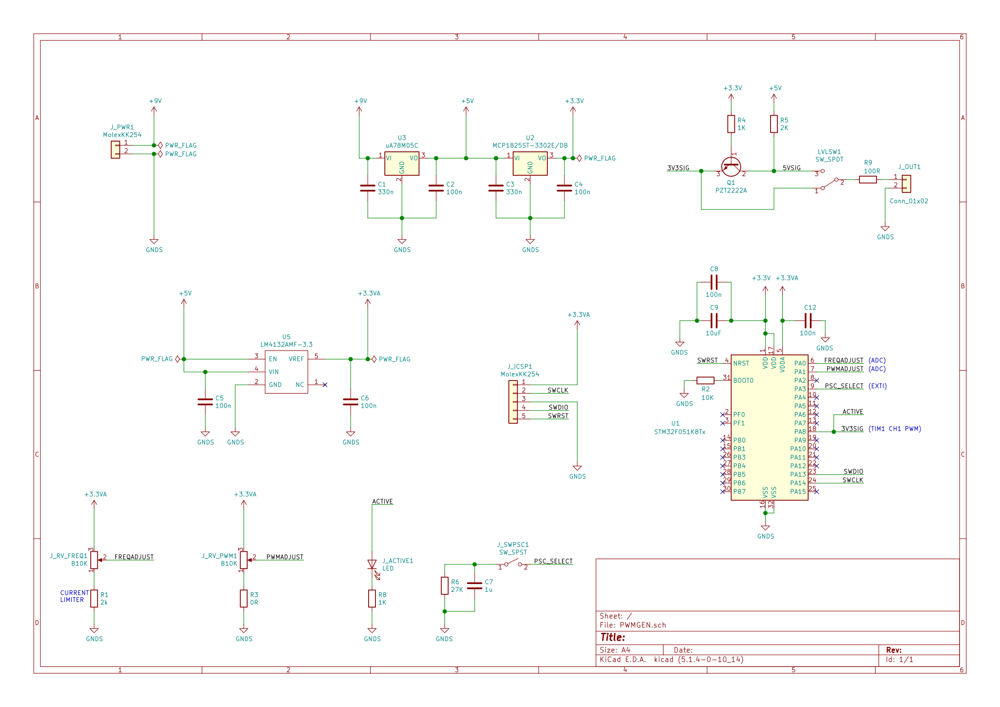

# PWMGEN
* A 10mm x 10mm PWM signal generator with duty, prescaler and frequency control. 
* Runs from a 9V DC power supply (5.5mm x 2.1mm connector).
* Supports both 3.3v and 5v logic level outputs.

 

